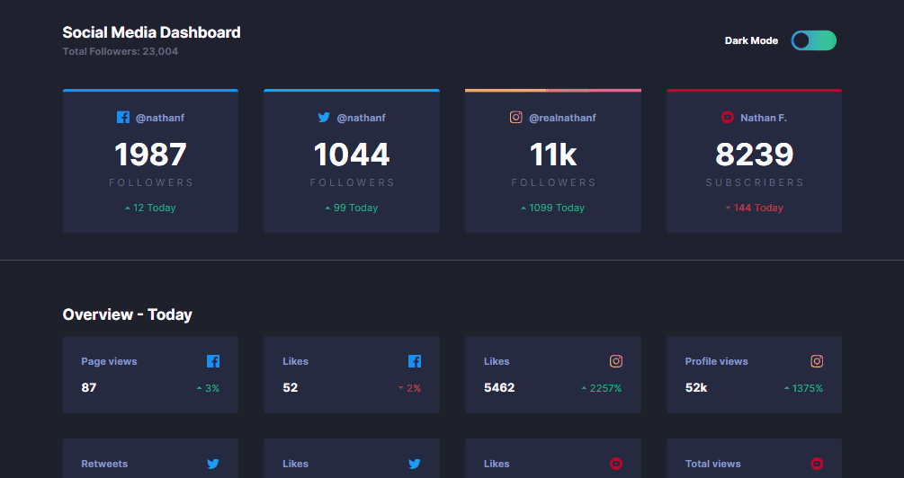
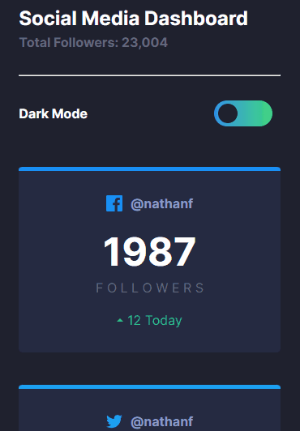

# Desafio Dashboard de Social Medias - Frontend-Mentor

Este é um desafio de um Dashboard para Social Medias proposto pelo site Frontend-Mentor.

## Tabela de Conteúdos

- [Visão Geral](#visão-geral)
    - [Imagens](#imagens)
    - [Link da página](#link)
- [Processo](#processo)
    - [Linguagens utilizadas](#linguagens-utilizadas)
    - [O que aprendi](#o-que-aprendi)
    - [Possíveis evoluções](#possíveis-evoluções)
- [Autor](#autor)

## Visão-geral

### Imagens

<br>

````
Versão de Desktop
````

   

<br>

````
Versão Mobile
````

 

### Link

- Página no GitHub Pages: <a href="https://julio-mansan2.github.io/dashboard-social-medias">Clique aqui!</a>

## Processo

### Linguagens utilizadas

<br>

- Marcações semânticas de HTML5
- Propriedades de customização do CSS3
- Estruturas de JavaScript

<br>

### O que aprendi

<br>

- Criar um switch toggle:

````html

<span id="span-toggle" class="dark-mode">Dark mode</span>
<input type="checkbox" id="switch" /><label for="switch">Toggle</label>

````

````css

input[type=checkbox] {
    height: 0;
    width: 0;
    visibility: hidden;
}

label {
    cursor: pointer;
    text-indent: -9999px;
    width: 4.5rem;
    height: 2rem;
    background-image: linear-gradient(90deg, hsl(210, 78%, 56%), hsl(146, 68%, 55%));
    display: block;
    border-radius: 6.25rem;
    position: relative;
    margin-right: 0.6rem;
    transition: 0.3s;
}

label:after {
    content: '';
    position: absolute;
    top: 0.25rem;
    left: 0.3rem;
    width: 1.5rem;
    height: 1.5rem;
    background: hsl(232, 19%, 15%);
    border-radius: 5.6rem;
    transition: 0.3s;
}

label:hover {
    opacity: 0.7;
}

input:checked+label {
    background-image: linear-gradient(90deg, hsl(230, 22%, 74%), hsl(230, 22%, 74%));
}

input:checked+label:after {
    left: calc(100% - 5px);
    transform: translateX(-100%);
    background-color: #fff;
}

````

- Aplicar uma função ao switch toggle:

````html

<span id="span-toggle" class="dark-mode">Dark mode</span>
<input type="checkbox" id="switch" /><label for="switch">Toggle</label>

````
````javascript

const switchToggle = document.getElementById('switch')
const heading = document.querySelectorAll('.heading')
const header = document.querySelector('.header')
const main = document.querySelector('.main')
const spanToggle = document.getElementById('span-toggle')

switchToggle.addEventListener('click', function (){
    
    for (let i = 0; i < heading.length; i++) {
    if (switchToggle.checked) { 
       heading[i].classList.remove('dark-mode')
       heading[i].classList.add('light-mode')
       header.classList.remove('bg-header-dark-theme')
       header.classList.add('bg-header-light-theme')
       main.classList.remove('bg-main-dark-theme')
       main.classList.add('bg-main-light-theme')
       spanToggle.classList.remove('dark-mode')
       spanToggle.classList.add('light-mode')
    } else {
        heading[i].classList.add('dark-mode')
       heading[i].classList.remove('light-mode')
       header.classList.add('bg-header-dark-theme')
       header.classList.remove('bg-header-light-theme')
       main.classList.add('bg-main-dark-theme')
       main.classList.remove('bg-main-light-theme')
       spanToggle.classList.add('dark-mode')
       spanToggle.classList.remove('light-mode')
    }
} })

````
<br>

### Possíveis evoluções

<br>

- Códigos mais compactos;
- Aplicar border-radius ao background, além de posicioná-lo da maneira correta.

<br>

## Autor

GitHub - <a href="https://github.com/julio-mansan2">julio-mansan2</a> <br>
Front-end Mentor - <a href="https://www.frontendmentor.io/profile/julio-mansan2">julio-mansan2</a> <br>
LinkedIn - <a href="https://www.linkedin.com/in/j%C3%BAlio-a-mansan-3415a7249/">Júlio A.</a> <br>